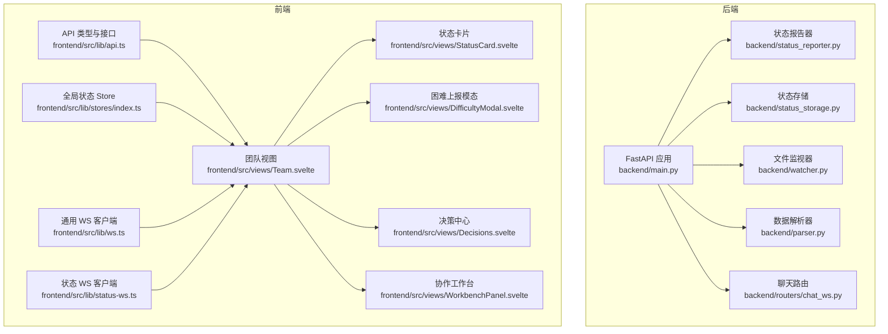
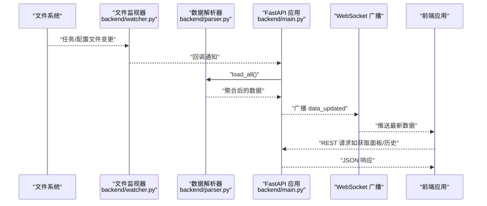
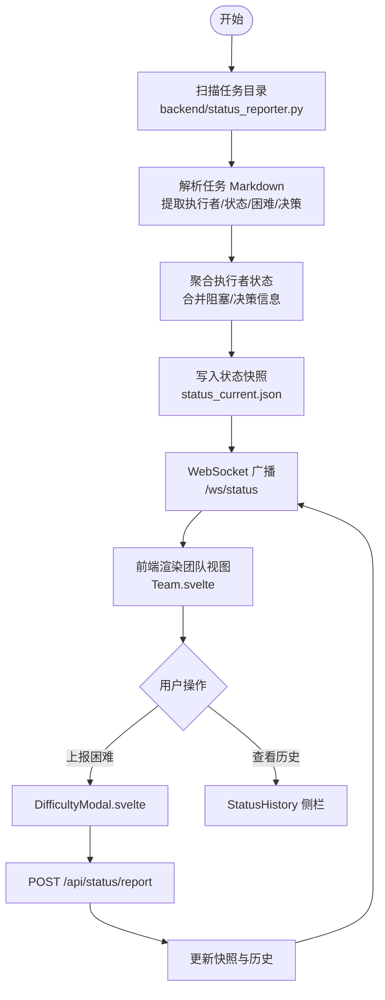
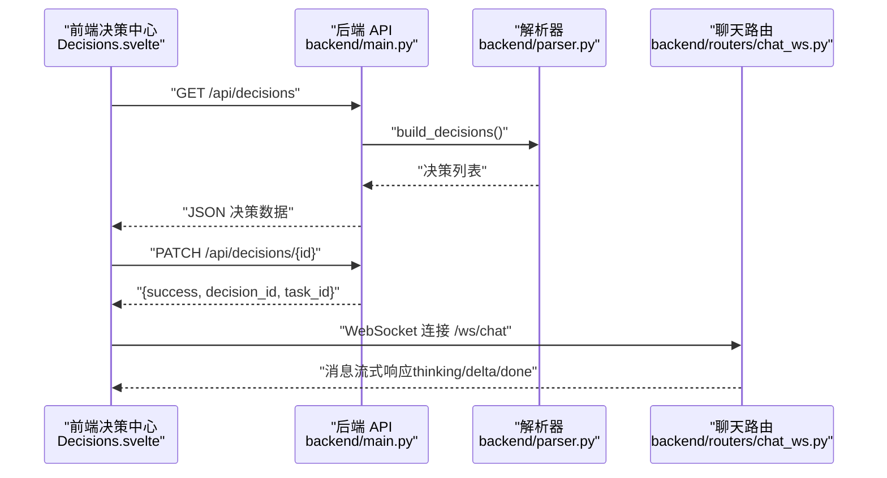
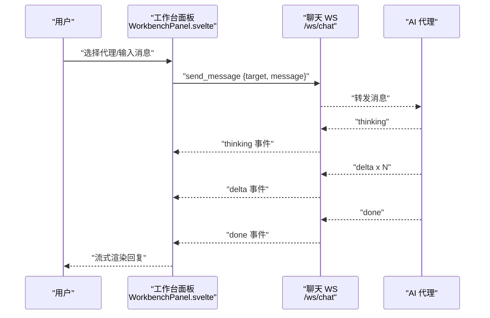
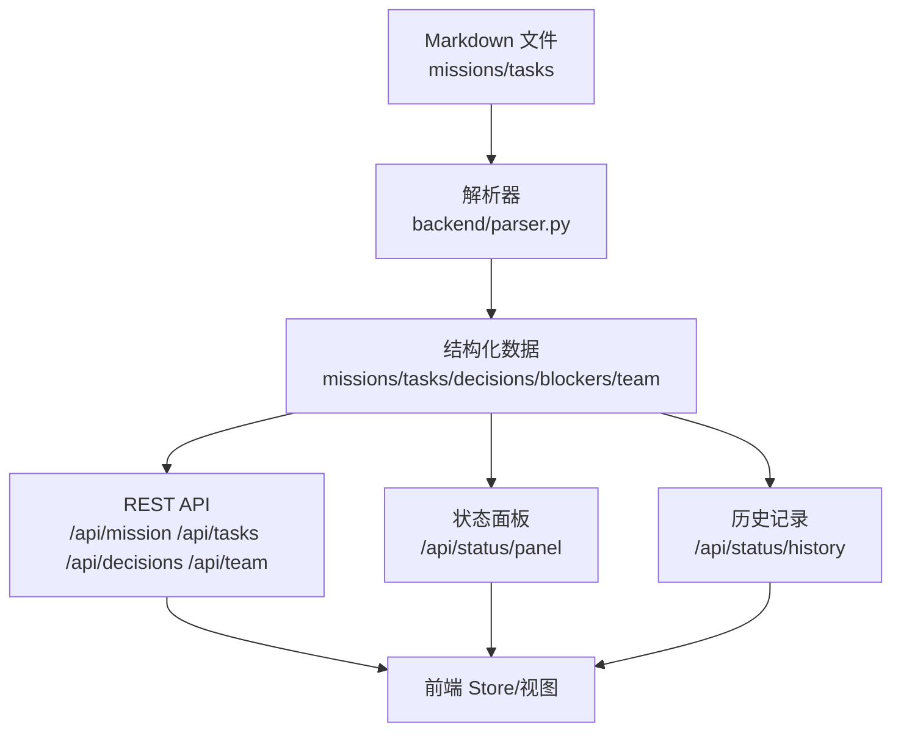
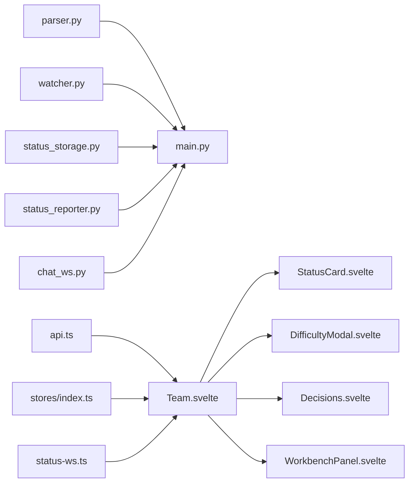

# 核心功能特性

<cite>
**本文引用的文件**
- [backend/main.py](file://backend/main.py)
- [backend/status_reporter.py](file://backend/status_reporter.py)
- [backend/status_storage.py](file://backend/status_storage.py)
- [backend/watcher.py](file://backend/watcher.py)
- [backend/parser.py](file://backend/parser.py)
- [backend/routers/chat_ws.py](file://backend/routers/chat_ws.py)
- [frontend/src/lib/api.ts](file://frontend/src/lib/api.ts)
- [frontend/src/lib/stores/index.ts](file://frontend/src/lib/stores/index.ts)
- [frontend/src/lib/ws.ts](file://frontend/src/lib/ws.ts)
- [frontend/src/lib/status-ws.ts](file://frontend/src/lib/status-ws.ts)
- [frontend/src/views/Team.svelte](file://frontend/src/views/Team.svelte)
- [frontend/src/views/StatusCard.svelte](file://frontend/src/views/StatusCard.svelte)
- [frontend/src/views/DifficultyModal.svelte](file://frontend/src/views/DifficultyModal.svelte)
- [frontend/src/views/Decisions.svelte](file://frontend/src/views/Decisions.svelte)
- [frontend/src/views/WorkbenchPanel.svelte](file://frontend/src/views/WorkbenchPanel.svelte)
- [run.sh](file://run.sh)
</cite>

## 目录
1. [引言](#引言)
2. [项目结构](#项目结构)
3. [核心组件](#核心组件)
4. [架构总览](#架构总览)
5. [详细组件分析](#详细组件分析)
6. [依赖关系分析](#依赖关系分析)
7. [性能考量](#性能考量)
8. [故障排查指南](#故障排查指南)
9. [结论](#结论)
10. [附录](#附录)

## 引言
本文件面向 SynapseOS 2.0 的使用者与维护者，系统性阐述四大核心功能特性：
- 实时状态监控系统：团队成员在线状态检测、工作进度跟踪与困难上报。
- 智能决策支持系统：待决策任务管理、AI 代理集成与决策历史记录。
- 协作工作台：任务面板、聊天界面与多视图切换。
- 数据驱动管理模式：Markdown 文件解析、自动状态同步与历史记录保存。

文档通过“后端 API + WebSocket + 前端 Svelte 组件”的协同机制，结合数据流与控制流图，帮助读者快速理解各功能的运行方式与使用场景。

## 项目结构
后端采用 FastAPI 提供 REST API 与 WebSocket，前端基于 Svelte + Vite 构建，通过统一的数据目录与文件监听实现数据驱动的状态面板与协作界面。

图表来源
- [backend/main.py:184-495](file://backend/main.py#L184-L495)
- [backend/status_reporter.py:258-274](file://backend/status_reporter.py#L258-L274)
- [backend/status_storage.py:102-236](file://backend/status_storage.py#L102-L236)
- [backend/watcher.py:8-52](file://backend/watcher.py#L8-L52)
- [backend/parser.py:441-509](file://backend/parser.py#L441-L509)
- [backend/routers/chat_ws.py](file://backend/routers/chat_ws.py)
- [frontend/src/lib/api.ts:75-181](file://frontend/src/lib/api.ts#L75-L181)
- [frontend/src/lib/stores/index.ts:1-46](file://frontend/src/lib/stores/index.ts#L1-L46)
- [frontend/src/lib/ws.ts:19-84](file://frontend/src/lib/ws.ts#L19-L84)
- [frontend/src/lib/status-ws.ts:12-78](file://frontend/src/lib/status-ws.ts#L12-L78)
- [frontend/src/views/Team.svelte:1-507](file://frontend/src/views/Team.svelte#L1-L507)
- [frontend/src/views/StatusCard.svelte:1-170](file://frontend/src/views/StatusCard.svelte#L1-L170)
- [frontend/src/views/DifficultyModal.svelte:1-175](file://frontend/src/views/DifficultyModal.svelte#L1-L175)
- [frontend/src/views/Decisions.svelte:1-142](file://frontend/src/views/Decisions.svelte#L1-L142)
- [frontend/src/views/WorkbenchPanel.svelte:1-369](file://frontend/src/views/WorkbenchPanel.svelte#L1-L369)

章节来源
- [backend/main.py:184-495](file://backend/main.py#L184-L495)
- [frontend/src/lib/api.ts:75-181](file://frontend/src/lib/api.ts#L75-L181)
- [frontend/src/views/Team.svelte:1-507](file://frontend/src/views/Team.svelte#L1-L507)

## 核心组件
- 实时状态监控系统
  - 后端：定时扫描任务 Markdown，生成状态快照；提供状态面板与历史查询接口；WebSocket 广播状态更新。
  - 前端：订阅状态频道，渲染团队角色卡片、状态卡片与历史侧栏。
- 智能决策支持系统
  - 后端：解析任务 Markdown 中的“果爸决策”段落，构建待决策清单；提供 REST 接口更新决策状态。
  - 前端：决策中心视图，按优先级与状态排序展示待决策事项。
- 协作工作台
  - 后端：提供聊天 WebSocket 路由，支持多代理消息流转。
  - 前端：工作台面板，支持多代理标签页、消息流式渲染与队列排队。
- 数据驱动管理模式
  - 后端：解析 mission/tasks 等 Markdown，构建任务、阻塞、决策与团队数据；文件变更触发前端数据更新。
  - 前端：Store 管理数据与 UI 状态，WebSocket 订阅数据更新事件。

章节来源
- [backend/status_reporter.py:189-243](file://backend/status_reporter.py#L189-L243)
- [backend/status_storage.py:102-193](file://backend/status_storage.py#L102-L193)
- [backend/parser.py:441-509](file://backend/parser.py#L441-L509)
- [frontend/src/views/Decisions.svelte:1-142](file://frontend/src/views/Decisions.svelte#L1-L142)
- [frontend/src/views/WorkbenchPanel.svelte:1-369](file://frontend/src/views/WorkbenchPanel.svelte#L1-L369)

## 架构总览
后端通过文件监听与定时任务驱动数据更新，前端通过 REST 与 WebSocket 获取最新状态，并在 UI 中实时呈现。

图表来源
- [backend/watcher.py:21-34](file://backend/watcher.py#L21-L34)
- [backend/parser.py:441-509](file://backend/parser.py#L441-L509)
- [backend/main.py:44-93](file://backend/main.py#L44-L93)
- [frontend/src/lib/ws.ts:43-54](file://frontend/src/lib/ws.ts#L43-L54)

## 详细组件分析

### 实时状态监控系统
- 数据来源与解析
  - 后端解析任务 Markdown，提取执行者、状态、优先级、困难与待决策等字段，生成结构化数据。
  - 定时扫描任务文件，汇总每个执行者的当前任务、进度、困难级别与是否需要决策。
- 状态面板与历史
  - 后端将状态快照写入 JSON 文件，前端通过 REST 获取面板；同时提供分页历史查询接口。
  - WebSocket 通道 /ws/status 实时推送状态更新，前端据此刷新团队视图。
- 前端展示
  - 团队视图按域分组展示角色卡片，标注在线/未报到/阻塞/待决策状态；点击“历史/困难”打开对应交互。
  - 状态卡片展示当前任务、进度、困难与决策摘要，并提供时间戳与操作入口。

图表来源
- [backend/status_reporter.py:189-243](file://backend/status_reporter.py#L189-L243)
- [backend/status_storage.py:102-126](file://backend/status_storage.py#L102-L126)
- [backend/main.py:318-346](file://backend/main.py#L318-L346)
- [frontend/src/views/Team.svelte:234-242](file://frontend/src/views/Team.svelte#L234-L242)
- [frontend/src/views/DifficultyModal.svelte:26-60](file://frontend/src/views/DifficultyModal.svelte#L26-L60)

章节来源
- [backend/status_reporter.py:129-173](file://backend/status_reporter.py#L129-L173)
- [backend/status_storage.py:102-193](file://backend/status_storage.py#L102-L193)
- [backend/main.py:318-384](file://backend/main.py#L318-L384)
- [frontend/src/views/Team.svelte:178-194](file://frontend/src/views/Team.svelte#L178-L194)
- [frontend/src/views/StatusCard.svelte:1-170](file://frontend/src/views/StatusCard.svelte#L1-L170)

使用场景与操作示例
- 场景一：团队成员发现阻塞问题
  - 操作：在团队视图点击“困难”，填写困难类型、紧急程度、任务关联与描述，提交后状态面板即时更新。
  - 关键接口：POST /api/status/report（困难类型），/ws/status 实时广播。
- 场景二：查看某成员历史状态
  - 操作：在团队视图点击“历史”，打开侧栏查看该成员的历史记录。
  - 关键接口：GET /api/status/history，/ws/status 推送事件。

### 智能决策支持系统
- 数据来源
  - 解析任务 Markdown 中的“果爸决策”段落，抽取最终决策与真相源，构建决策清单。
- 决策管理
  - 后端提供 REST 接口更新决策状态（批准/拒绝），并同步到任务文件相应区域。
  - 前端“决策中心”按状态与优先级排序展示待决策事项，便于集中处理。
- AI 代理集成
  - 后端提供聊天 WebSocket 路由，前端工作台支持多代理标签页与消息流式渲染，实现与 AI 代理的交互。

图表来源
- [backend/parser.py:416-437](file://backend/parser.py#L416-L437)
- [backend/main.py:218-298](file://backend/main.py#L218-L298)
- [frontend/src/views/Decisions.svelte:1-142](file://frontend/src/views/Decisions.svelte#L1-L142)
- [backend/routers/chat_ws.py](file://backend/routers/chat_ws.py)

章节来源
- [backend/parser.py:254-290](file://backend/parser.py#L254-L290)
- [backend/main.py:218-298](file://backend/main.py#L218-L298)
- [frontend/src/views/Decisions.svelte:22-31](file://frontend/src/views/Decisions.svelte#L22-L31)

使用场景与操作示例
- 场景三：审批任务决策
  - 操作：在决策中心选择待决策项，点击“同意/拒绝”，后端更新任务文件中的“果爸决策”段落并广播状态。
  - 关键接口：PATCH /api/decisions/{id}。
- 场景四：与 AI 代理协作
  - 操作：在工作台面板选择不同代理标签页，输入消息，查看流式回复与思考过程。
  - 关键接口：WebSocket /ws/chat。

### 协作工作台
- 多视图与多代理
  - 前端工作台支持三个代理标签页（果爸、苏珊、里德），独立的消息队列与流式渲染。
  - 支持智能滚动与新消息提示，避免打断用户阅读。
- 聊天流程
  - 建立 WebSocket 连接，发送消息后接收 thinking/delta/done 事件，逐步渲染回复。
  - 若代理正在回复，后续消息进入队列等待。

图表来源
- [frontend/src/views/WorkbenchPanel.svelte:82-149](file://frontend/src/views/WorkbenchPanel.svelte#L82-L149)
- [backend/routers/chat_ws.py](file://backend/routers/chat_ws.py)

章节来源
- [frontend/src/views/WorkbenchPanel.svelte:199-202](file://frontend/src/views/WorkbenchPanel.svelte#L199-L202)
- [frontend/src/views/WorkbenchPanel.svelte:152-191](file://frontend/src/views/WorkbenchPanel.svelte#L152-L191)

使用场景与操作示例
- 场景五：跨代理协作
  - 操作：在不同代理标签页间切换，分别与果爸、苏珊、里德进行对话，查看各自历史与思考过程。
  - 关键接口：WebSocket /ws/chat，消息类型包含 thinking/delta/done。

### 数据驱动管理模式
- Markdown 解析
  - 解析 mission 与 task 的 frontmatter 与正文，提取标题、状态、优先级、执行者、决策等字段。
  - 构建任务、阻塞、决策与团队数据，用于前端展示与状态计算。
- 自动同步与历史
  - 文件变更触发后端广播，前端自动更新；状态上报与历史查询接口保证数据一致性。
  - 前端 Store 管理派生状态（如待完成/待决策/阻塞）与 UI 展示。

图表来源
- [backend/parser.py:123-342](file://backend/parser.py#L123-L342)
- [backend/main.py:200-314](file://backend/main.py#L200-L314)
- [frontend/src/lib/stores/index.ts:23-45](file://frontend/src/lib/stores/index.ts#L23-L45)

章节来源
- [backend/parser.py:441-509](file://backend/parser.py#L441-L509)
- [backend/main.py:200-314](file://backend/main.py#L200-L314)
- [frontend/src/lib/stores/index.ts:14-45](file://frontend/src/lib/stores/index.ts#L14-L45)

使用场景与操作示例
- 场景六：查看里程碑与任务列表
  - 操作：访问任务列表与里程碑视图，根据任务状态与优先级进行排期。
  - 关键接口：GET /api/tasks、GET /api/mission。

## 依赖关系分析
- 后端模块耦合
  - main.py 依赖 parser、watcher、status_storage、status_reporter 与聊天路由，形成“数据输入 → 存储/快照 → 广播”的闭环。
- 前端模块耦合
  - Team.svelte 依赖 api.ts、stores/index.ts、status-ws.ts 与多个子视图；WorkbenchPanel.svelte 依赖聊天路由与自身状态管理。
- 外部依赖
  - Python 依赖（uvicorn、watchfiles、fastapi 等）与 Node 依赖（Svelte、Vite 等）通过启动脚本安装与运行。

图表来源
- [backend/main.py:15-21](file://backend/main.py#L15-L21)
- [backend/parser.py:1-8](file://backend/parser.py#L1-L8)
- [backend/watcher.py:1-6](file://backend/watcher.py#L1-L6)
- [backend/status_storage.py:1-9](file://backend/status_storage.py#L1-L9)
- [backend/status_reporter.py:1-6](file://backend/status_reporter.py#L1-L6)
- [backend/routers/chat_ws.py](file://backend/routers/chat_ws.py)
- [frontend/src/lib/api.ts:1-181](file://frontend/src/lib/api.ts#L1-L181)
- [frontend/src/lib/stores/index.ts:1-46](file://frontend/src/lib/stores/index.ts#L1-L46)
- [frontend/src/lib/status-ws.ts:1-78](file://frontend/src/lib/status-ws.ts#L1-L78)
- [frontend/src/views/Team.svelte:1-507](file://frontend/src/views/Team.svelte#L1-L507)
- [frontend/src/views/StatusCard.svelte:1-170](file://frontend/src/views/StatusCard.svelte#L1-L170)
- [frontend/src/views/DifficultyModal.svelte:1-175](file://frontend/src/views/DifficultyModal.svelte#L1-L175)
- [frontend/src/views/Decisions.svelte:1-142](file://frontend/src/views/Decisions.svelte#L1-L142)
- [frontend/src/views/WorkbenchPanel.svelte:1-369](file://frontend/src/views/WorkbenchPanel.svelte#L1-L369)

章节来源
- [backend/main.py:15-21](file://backend/main.py#L15-L21)
- [frontend/src/lib/api.ts:75-181](file://frontend/src/lib/api.ts#L75-L181)

## 性能考量
- 文件监听与去抖
  - 后端使用文件监听与去抖机制，减少频繁广播带来的网络与 CPU 压力。
- WebSocket 心跳与断线重连
  - 前端 WS 客户端实现心跳与指数退避重连，提升稳定性。
- 历史查询分页
  - 历史接口支持分页与过滤，避免一次性加载大量数据。
- 前端 Store 派生状态
  - 使用 Svelte 派生 store 减少重复计算，提高渲染效率。

## 故障排查指南
- 后端服务未启动
  - 使用一键脚本检查状态与日志，确认依赖安装与端口占用情况。
- WebSocket 断开
  - 查看前端 WS 控制台输出与重连日志；确认后端 /ws 与 /ws/status 路由可用。
- 状态不更新
  - 检查任务 Markdown 是否符合解析规则；确认定时任务与文件监听是否正常。
- 历史查询为空
  - 确认历史文件存在且格式正确；检查过滤参数与分页范围。

章节来源
- [run.sh:172-191](file://run.sh#L172-L191)
- [frontend/src/lib/ws.ts:57-69](file://frontend/src/lib/ws.ts#L57-L69)
- [frontend/src/lib/status-ws.ts:51-63](file://frontend/src/lib/status-ws.ts#L51-L63)

## 结论
SynapseOS 2.0 通过“后端数据解析与定时扫描 + WebSocket 实时广播 + 前端 Svelte 组件”的组合，实现了从任务数据到状态面板、从困难上报到决策中心、从聊天工作台到历史记录的全链路数据驱动协作体验。系统具备良好的扩展性与可维护性，适合在团队协作与项目管理场景中持续演进。

## 附录
- 快速启动
  - 使用一键脚本启动后端与前端，查看日志定位问题。
- 常用接口
  - GET /api/mission、/api/tasks、/api/blockers、/api/decisions、/api/team
  - GET /api/status/panel、/api/status/history、/api/status/{agent_id}
  - POST /api/status/report、/api/status/difficulty
  - PATCH /api/decisions/{decision_id}

章节来源
- [run.sh:120-138](file://run.sh#L120-L138)
- [backend/main.py:200-384](file://backend/main.py#L200-L384)