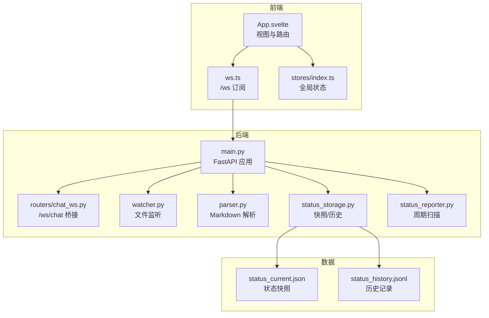
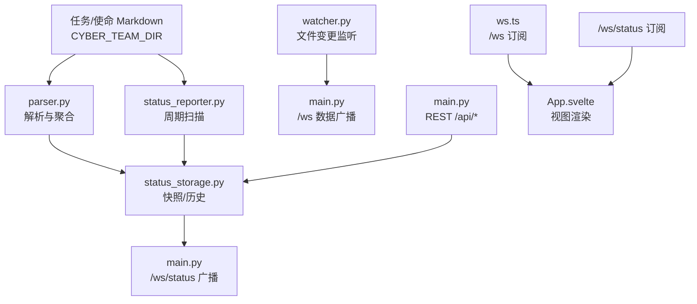
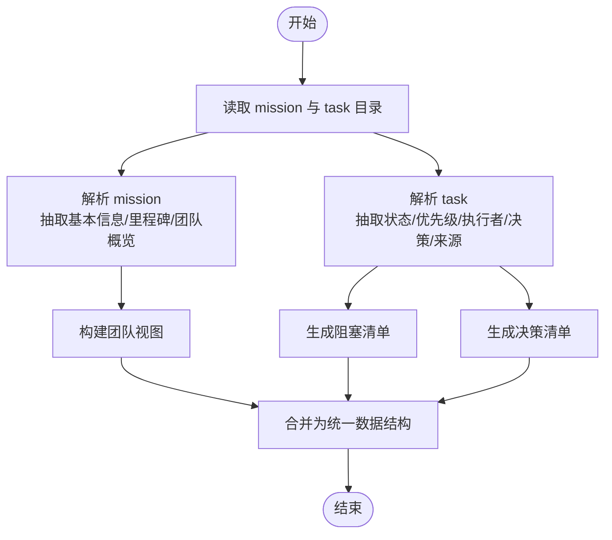
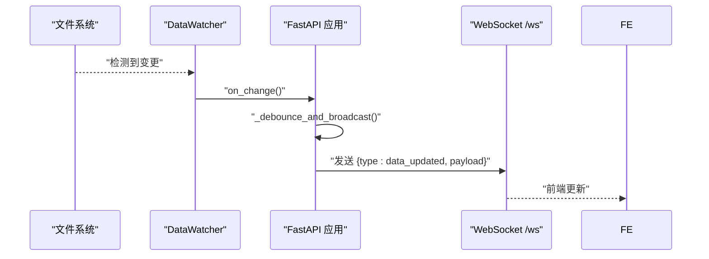
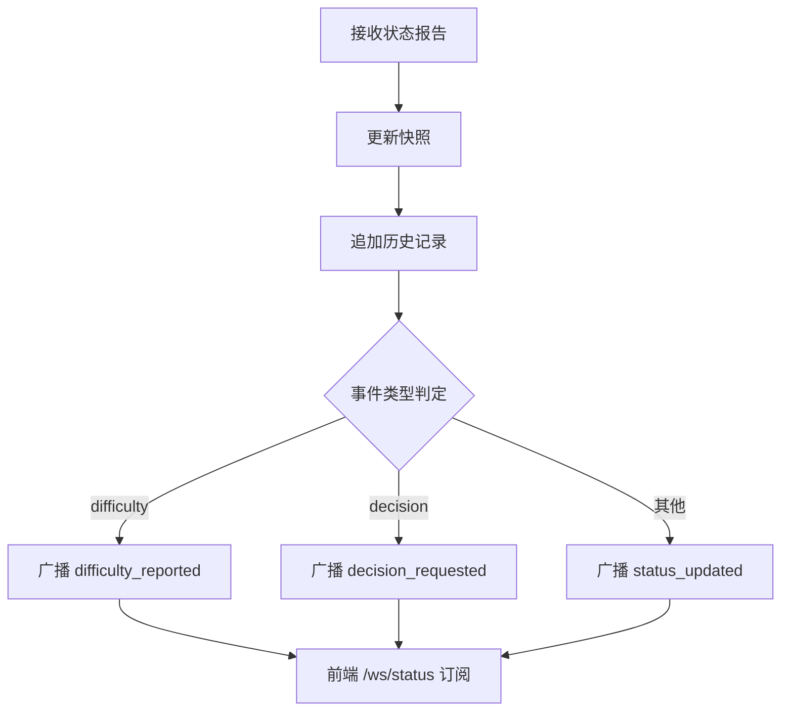
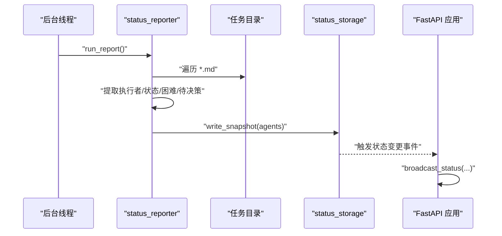
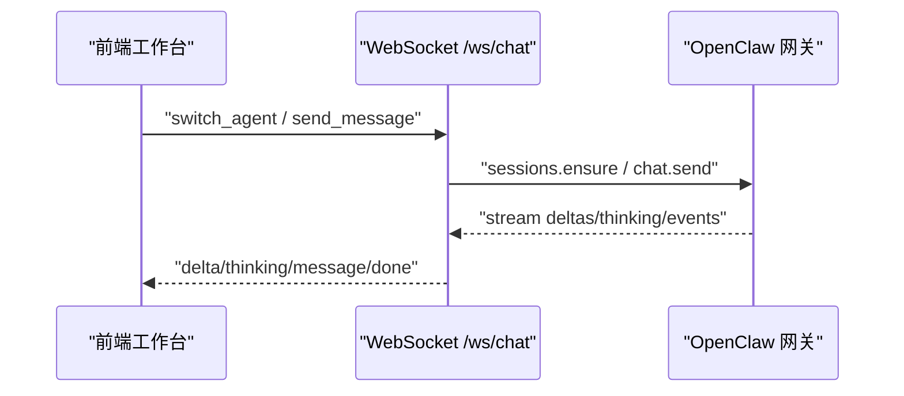
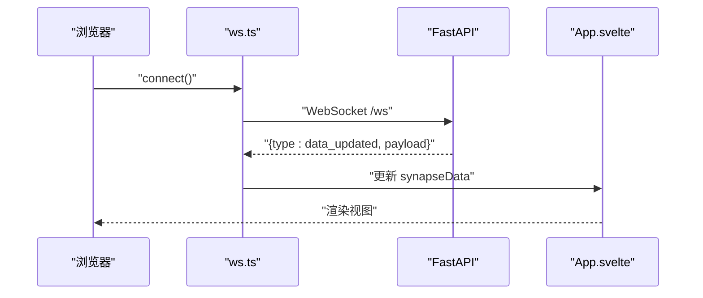
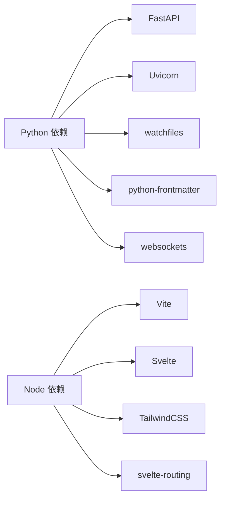

# 项目概述

<cite>
**本文引用的文件**
- [backend/main.py](file://backend/main.py)
- [backend/parser.py](file://backend/parser.py)
- [backend/watcher.py](file://backend/watcher.py)
- [backend/status_storage.py](file://backend/status_storage.py)
- [backend/status_reporter.py](file://backend/status_reporter.py)
- [backend/routers/chat_ws.py](file://backend/routers/chat_ws.py)
- [backend/requirements.txt](file://backend/requirements.txt)
- [frontend/src/App.svelte](file://frontend/src/App.svelte)
- [frontend/src/lib/stores/index.ts](file://frontend/src/lib/stores/index.ts)
- [frontend/src/lib/ws.ts](file://frontend/src/lib/ws.ts)
- [frontend/package.json](file://frontend/package.json)
- [run.sh](file://run.sh)
- [data/status_current.json](file://data/status_current.json)
</cite>

## 目录
1. [引言](#引言)
2. [项目结构](#项目结构)
3. [核心组件](#核心组件)
4. [架构总览](#架构总览)
5. [详细组件分析](#详细组件分析)
6. [依赖分析](#依赖分析)
7. [性能考虑](#性能考虑)
8. [故障排查指南](#故障排查指南)
9. [结论](#结论)
10. [附录](#附录)

## 引言
SynapseOS 2.0 是一个面向赛博团队的实时协作与智能决策平台。它通过统一的数据源（任务与使命的 Markdown 文档）驱动前端看板，提供团队状态可视化、智能决策支持与 AI 代理工作台的无缝集成。系统强调“所见即所得”的数据同步、低延迟的实时更新与可扩展的 AI 代理桥接能力，帮助团队在复杂任务流中保持透明、高效与可控。

- 核心价值主张
  - 实时协作：基于文件变更的自动广播，确保前端看板与任务状态实时同步。
  - 智能决策支持：从任务 Markdown 中抽取“待决策”与“困难”信息，形成阻塞与待办清单。
  - AI 代理集成：通过 WebSocket 桥接到 OpenClaw 网关，提供多代理会话与思考过程流式输出。
  - 可观测性：状态快照与历史记录，支持按代理、任务、类型过滤的分页查询。

- 主要功能特性
  - 数据解析与聚合：解析 mission 与 task 的 Markdown，构建任务、阻塞、决策与团队视图。
  - 实时状态面板：周期性扫描任务文件生成状态快照，前端通过专用 WebSocket 订阅。
  - 决策与阻塞管理：自动识别“待决策”与“困难”，驱动工作台与导航角标。
  - AI 工作台：连接本地 OpenClaw 网关，支持会话切换、历史加载与流式响应。

- 目标用户与场景
  - 目标用户：赛博团队成员（架构师、开发者、设计师、管理者），以及需要跨代理协作的智能体。
  - 应用场景：日常任务推进跟踪、跨职能阻塞识别、高层决策入口、AI 代理协同工作台。

## 项目结构
项目采用前后端分离与数据驱动的设计：
- 后端（Python/FastAPI）负责数据解析、文件监听、状态快照与历史持久化、REST 与 WebSocket API。
- 前端（Svelte/Vite）负责视图渲染、路由与实时订阅，提供使命、待决策、团队三个核心视图。
- 数据层（JSON/JSONL）用于状态快照与历史记录的持久化。
- 运维脚本（run.sh）提供一键安装、启动、停止与日志查看。

图表来源
- [backend/main.py:184-495](file://backend/main.py#L184-L495)
- [backend/watcher.py:1-52](file://backend/watcher.py#L1-L52)
- [backend/parser.py:440-509](file://backend/parser.py#L440-L509)
- [backend/status_storage.py:10-236](file://backend/status_storage.py#L10-L236)
- [backend/status_reporter.py:190-267](file://backend/status_reporter.py#L190-L267)
- [backend/routers/chat_ws.py:139-319](file://backend/routers/chat_ws.py#L139-L319)
- [frontend/src/App.svelte:119-141](file://frontend/src/App.svelte#L119-L141)
- [frontend/src/lib/ws.ts:19-84](file://frontend/src/lib/ws.ts#L19-L84)
- [frontend/src/lib/stores/index.ts:1-46](file://frontend/src/lib/stores/index.ts#L1-L46)

章节来源
- [backend/main.py:184-495](file://backend/main.py#L184-L495)
- [frontend/src/App.svelte:119-141](file://frontend/src/App.svelte#L119-L141)
- [frontend/src/lib/ws.ts:19-84](file://frontend/src/lib/ws.ts#L19-L84)
- [frontend/src/lib/stores/index.ts:1-46](file://frontend/src/lib/stores/index.ts#L1-L46)

## 核心组件
- 数据解析器（parser.py）
  - 解析 mission 与 task 的 Markdown，抽取元数据、里程碑、执行者、优先级、决策状态等，构建统一数据模型。
  - 生成团队视图与阻塞/决策清单，支撑前端看板。

- 文件监听器（watcher.py）
  - 基于异步文件监控，检测数据目录变化后触发回调，实现“文件变更 → 广播更新”的实时联动。

- 状态存储（status_storage.py）
  - 维护状态快照（JSON）与历史记录（JSONL），提供查询、分页与过滤能力；内置过期检测与下次上报时间计算。

- 状态报告器（status_reporter.py）
  - 周期扫描任务文件，将执行者状态映射为代理快照，写入状态快照文件，供前端实时展示。

- WebSocket 与 REST API（main.py）
  - 提供 /ws（数据更新）、/ws/status（状态面板）、/ws/chat（AI 工作台）等通道。
  - 提供 /api/* 系列 REST 接口，读取 mission、tasks、blockers、decisions、team 与状态面板/历史。

- 前端应用（frontend/src/App.svelte）
  - Svelte 单页应用，基于哈希路由切换视图；通过 ws.ts 订阅 /ws 与 /ws/status，使用 stores/index.ts 管理全局状态。

章节来源
- [backend/parser.py:16-509](file://backend/parser.py#L16-L509)
- [backend/watcher.py:8-52](file://backend/watcher.py#L8-L52)
- [backend/status_storage.py:32-236](file://backend/status_storage.py#L32-L236)
- [backend/status_reporter.py:189-267](file://backend/status_reporter.py#L189-L267)
- [backend/main.py:396-495](file://backend/main.py#L396-L495)
- [frontend/src/App.svelte:119-141](file://frontend/src/App.svelte#L119-L141)
- [frontend/src/lib/stores/index.ts:1-46](file://frontend/src/lib/stores/index.ts#L1-L46)

## 架构总览
系统采用“数据驱动 + 实时推送”的架构模式：
- 数据源：任务与使命的 Markdown 文件（位于 CYBER_TEAM_DIR）。
- 解析与聚合：parser.py 与 status_reporter.py 将 Markdown 转换为结构化数据。
- 存储与查询：status_storage.py 负责快照与历史持久化，提供 REST 查询接口。
- 实时通道：watcher.py 触发数据更新广播；status_reporter.py 触发状态面板广播。
- 前端消费：App.svelte 通过 ws.ts 订阅两条 WebSocket 流，动态刷新视图。

图表来源
- [backend/parser.py:440-509](file://backend/parser.py#L440-L509)
- [backend/status_reporter.py:258-267](file://backend/status_reporter.py#L258-L267)
- [backend/status_storage.py:102-193](file://backend/status_storage.py#L102-L193)
- [backend/watcher.py:29-40](file://backend/watcher.py#L29-L40)
- [backend/main.py:44-94](file://backend/main.py#L44-L94)
- [backend/main.py:68-84](file://backend/main.py#L68-L84)
- [backend/main.py:200-385](file://backend/main.py#L200-L385)
- [frontend/src/lib/ws.ts:19-84](file://frontend/src/lib/ws.ts#L19-L84)
- [frontend/src/App.svelte:119-141](file://frontend/src/App.svelte#L119-L141)

## 详细组件分析

### 数据解析与聚合（parser.py）
- 关键职责
  - 解析 mission 与 task 的 frontmatter 与正文，抽取字段并标准化状态与优先级。
  - 从任务中提取“果爸决策”“来源类型”“创建者”等信息，构建决策与阻塞视图。
  - 生成团队成员列表，汇总当前任务与在线状态。

- 复杂度与性能
  - 解析复杂度近似 O(N)（N 为任务数量），I/O 主导；通过增量监听减少全量扫描频率。
  - 采用正则与表头解析，保证对 Markdown 结构的稳健性。

- 错误处理
  - 对缺失字段与格式异常进行容错处理，避免中断整体流程。

图表来源
- [backend/parser.py:440-509](file://backend/parser.py#L440-L509)

章节来源
- [backend/parser.py:16-509](file://backend/parser.py#L16-L509)

### 文件监听与数据广播（watcher.py 与 main.py）
- 控制流
  - watcher.py 异步监听数据目录，检测到变更后触发回调。
  - main.py 的 debounce 机制在短时间内合并多次变更，降低广播压力。
  - 广播通过 /ws 发送“data_updated”事件，前端订阅后更新视图。

图表来源
- [backend/watcher.py:29-40](file://backend/watcher.py#L29-L40)
- [backend/main.py:61-94](file://backend/main.py#L61-L94)

章节来源
- [backend/watcher.py:8-52](file://backend/watcher.py#L8-L52)
- [backend/main.py:44-94](file://backend/main.py#L44-L94)

### 状态快照与历史（status_storage.py）
- 数据模型
  - 快照：包含 updated_at 与 agents 映射，每个代理包含进度、困难、待决策、任务 ID 等字段。
  - 历史：每条记录为独立 JSON 行，便于流式追加与过滤查询。

- 查询与过滤
  - 支持按 agent_id、type、时间范围、task_id 分页查询，限制最大页大小。

图表来源
- [backend/status_storage.py:32-100](file://backend/status_storage.py#L32-L100)
- [backend/status_storage.py:138-193](file://backend/status_storage.py#L138-L193)
- [backend/main.py:318-347](file://backend/main.py#L318-L347)

章节来源
- [backend/status_storage.py:102-193](file://backend/status_storage.py#L102-L193)
- [backend/main.py:318-385](file://backend/main.py#L318-L385)

### 状态报告器（status_reporter.py）
- 周期扫描
  - 每 60 秒扫描任务目录，解析执行者、状态、困难与待决策，生成代理快照并写入文件。
- 代理映射
  - 将中文名/昵称映射为 agent_id，并注入角色与领域信息。

图表来源
- [backend/status_reporter.py:258-267](file://backend/status_reporter.py#L258-L267)
- [backend/status_storage.py:246-256](file://backend/status_storage.py#L246-L256)
- [backend/main.py:105-161](file://backend/main.py#L105-L161)

章节来源
- [backend/status_reporter.py:189-267](file://backend/status_reporter.py#L189-L267)
- [backend/main.py:105-161](file://backend/main.py#L105-L161)

### AI 代理工作台（chat_ws.py）
- 功能
  - 连接本地 OpenClaw 网关，支持会话创建/切换、历史加载与流式响应。
  - 将网关事件转换为前端消息（delta/thinking/message/done/error）。

图表来源
- [backend/routers/chat_ws.py:139-319](file://backend/routers/chat_ws.py#L139-L319)

章节来源
- [backend/routers/chat_ws.py:139-319](file://backend/routers/chat_ws.py#L139-L319)

### 前端应用与实时订阅（App.svelte 与 ws.ts）
- 视图与路由
  - 基于哈希路由切换“使命/待决策/团队”，顶部显示实时连接状态与最后更新时间。
- 实时订阅
  - /ws 推送全量数据，/ws/status 专门推送状态面板，前端订阅后更新 stores，驱动视图渲染。

图表来源
- [frontend/src/lib/ws.ts:19-84](file://frontend/src/lib/ws.ts#L19-L84)
- [frontend/src/App.svelte:119-141](file://frontend/src/App.svelte#L119-L141)

章节来源
- [frontend/src/App.svelte:119-141](file://frontend/src/App.svelte#L119-L141)
- [frontend/src/lib/ws.ts:19-84](file://frontend/src/lib/ws.ts#L19-L84)
- [frontend/src/lib/stores/index.ts:1-46](file://frontend/src/lib/stores/index.ts#L1-L46)

## 依赖分析
- 后端依赖
  - FastAPI、Uvicorn：Web 框架与 ASGI 服务器。
  - watchfiles：异步文件监控。
  - python-frontmatter：Markdown frontmatter 解析。
  - websockets：与 OpenClaw 网关通信。

- 前端依赖
  - Vite、Svelte、TailwindCSS：开发与构建工具链。
  - svelte-routing：轻量路由。

图表来源
- [backend/requirements.txt:1-6](file://backend/requirements.txt#L1-L6)
- [frontend/package.json:11-23](file://frontend/package.json#L11-L23)

章节来源
- [backend/requirements.txt:1-6](file://backend/requirements.txt#L1-L6)
- [frontend/package.json:11-23](file://frontend/package.json#L11-L23)

## 性能考虑
- 实时性
  - 文件变更去抖动（默认 300ms）减少广播风暴；状态报告器每 60 秒扫描一次，兼顾实时与性能。
- I/O 优化
  - JSONL 历史记录逐行追加，查询时按需过滤；快照为单一 JSON 文件，读写简单高效。
- 前端渲染
  - 使用 Svelte store 精准更新，视图按需重绘；WebSocket 心跳与断线重连保障连接稳定性。

## 故障排查指南
- 启动与日志
  - 使用 run.sh 的 logs 子命令查看后端与前端日志尾部，定位启动错误与运行异常。
- WebSocket 连接
  - 若 /ws 与 /ws/status 无法连接，检查后端是否正常监听、前端是否正确指向同机地址。
- 状态面板为空
  - 确认 CYBER_TEAM_DIR 下存在任务文件且可被 status_reporter.py 扫描；检查 status_current.json 是否生成。
- 决策与阻塞未出现
  - 确认任务 Markdown 中包含“果爸决策”“待决策”“困难”等字段；核对解析规则与字段命名一致性。
- AI 工作台无响应
  - 确认本地 OpenClaw 网关服务可用、Token 有效、端口可达；检查 /ws/chat 的连接与事件流。

章节来源
- [run.sh:162-170](file://run.sh#L162-L170)
- [backend/main.py:396-495](file://backend/main.py#L396-L495)
- [backend/status_reporter.py:258-267](file://backend/status_reporter.py#L258-L267)
- [data/status_current.json:1-59](file://data/status_current.json#L1-L59)

## 结论
SynapseOS 2.0 通过“数据驱动 + 实时推送 + AI 代理桥接”的组合，为赛博团队提供了从任务推进到智能决策再到协作工作的完整闭环。其模块化设计与清晰的职责边界，既满足初学者快速上手，也为有经验的开发者提供了扩展与定制的空间。

## 附录
- 快速开始
  - 环境要求：Python 3、Node.js、npm。
  - 安装与启动：执行 run.sh start，等待后端与前端分别启动；访问 http://localhost:5173 查看前端，http://localhost:8000/docs 查看 API 文档。
  - 基本使用：在任务 Markdown 中维护“状态/困难/待决策/执行者”等字段，系统将自动解析并展示在前端；在工作台中与 AI 代理交互，体验流式响应。

章节来源
- [run.sh:57-138](file://run.sh#L57-L138)
- [backend/main.py:480-495](file://backend/main.py#L480-L495)