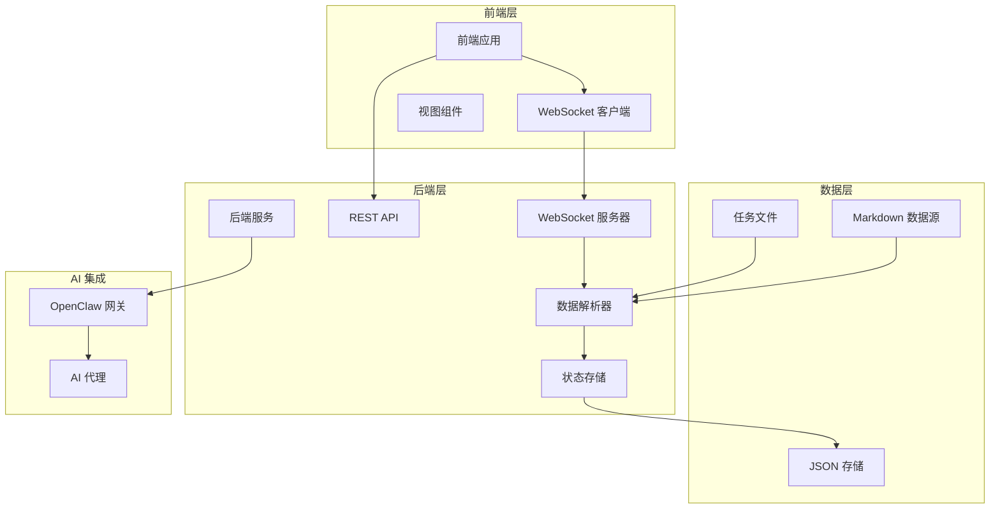
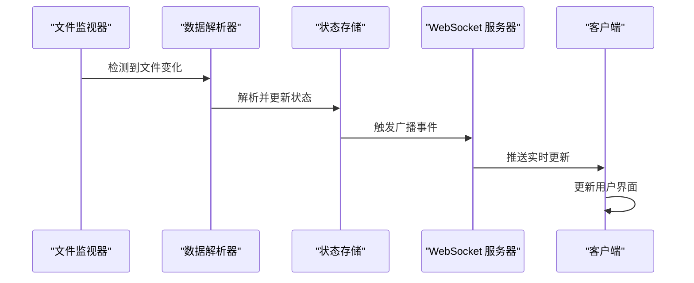
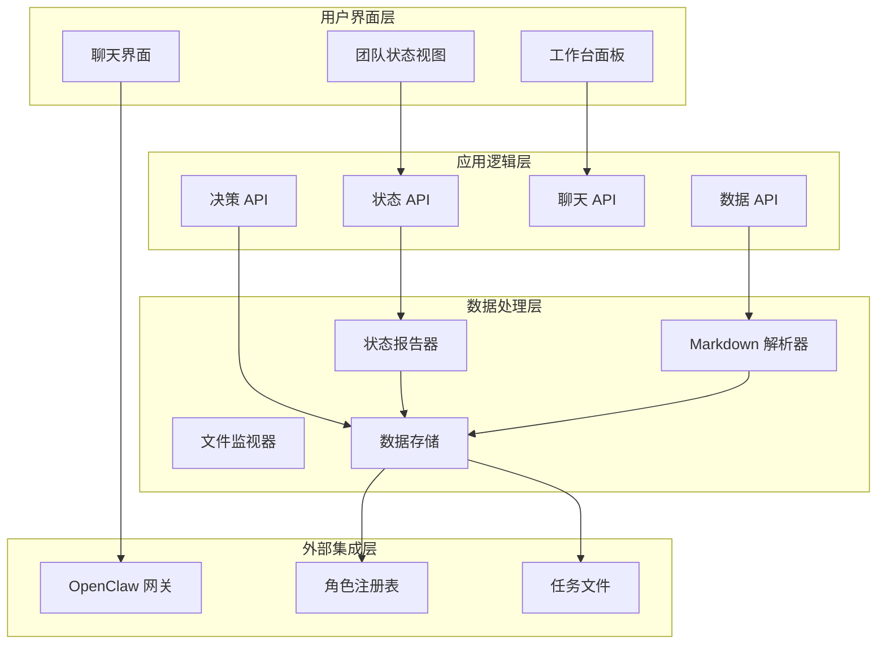
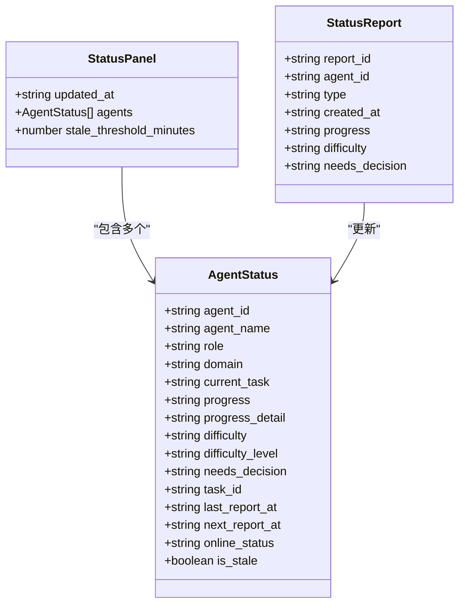
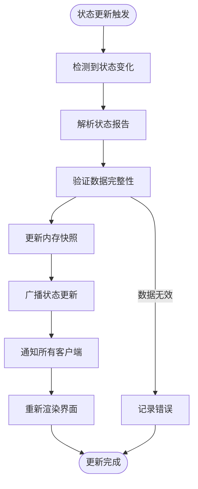
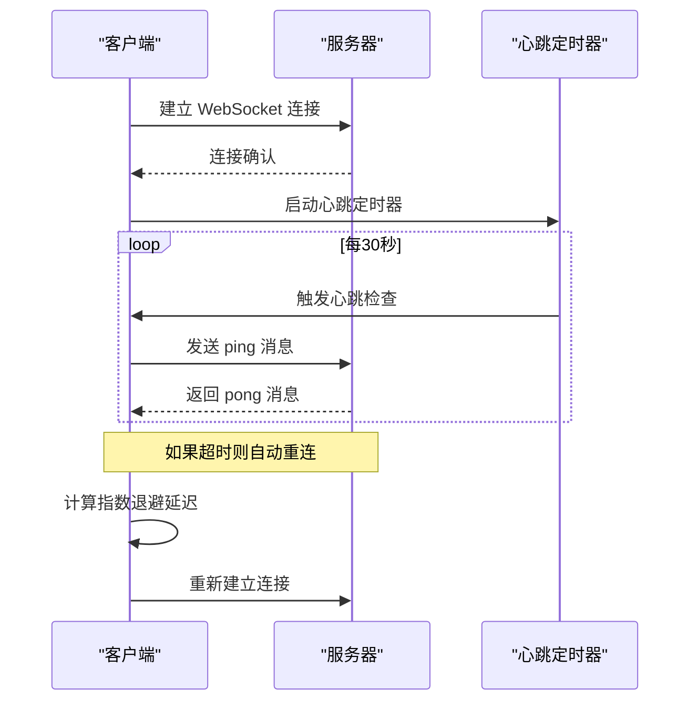
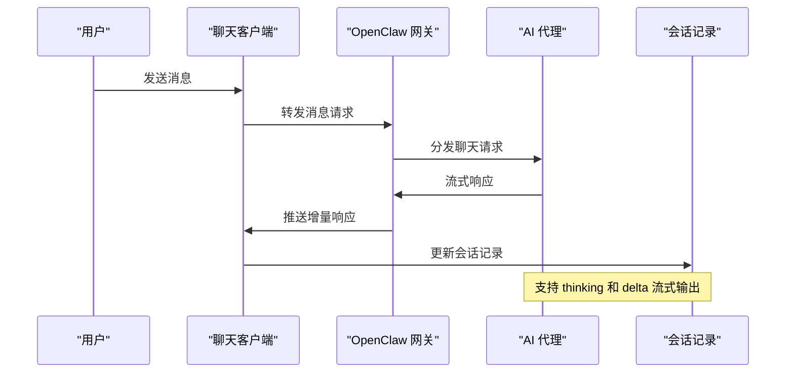
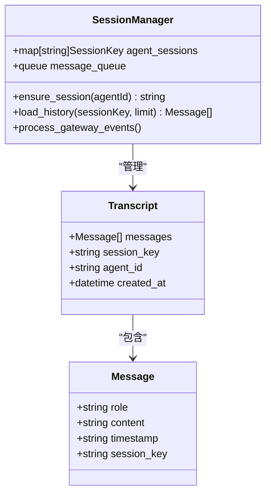
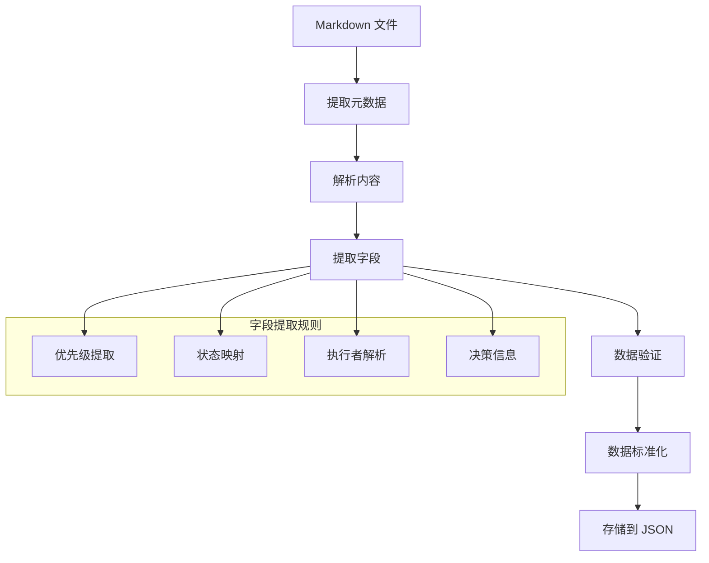
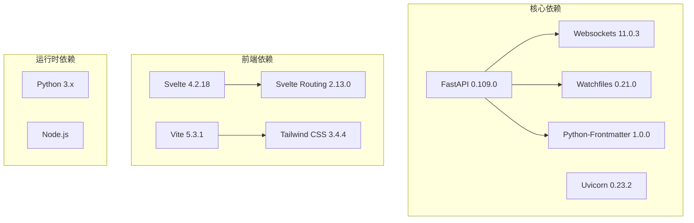

# 项目简介

<cite>
**本文档引用的文件**
- [backend/main.py](file://backend/main.py)
- [backend/routers/chat_ws.py](file://backend/routers/chat_ws.py)
- [backend/status_storage.py](file://backend/status_storage.py)
- [backend/status_reporter.py](file://backend/status_reporter.py)
- [backend/watcher.py](file://backend/watcher.py)
- [backend/parser.py](file://backend/parser.py)
- [frontend/src/lib/ws.ts](file://frontend/src/lib/ws.ts)
- [frontend/src/lib/status-ws.ts](file://frontend/src/lib/status-ws.ts)
- [frontend/src/views/Team.svelte](file://frontend/src/views/Team.svelte)
- [frontend/src/views/WorkbenchPanel.svelte](file://frontend/src/views/WorkbenchPanel.svelte)
- [run.sh](file://run.sh)
- [data/status_current.json](file://data/status_current.json)
</cite>

## 目录
1. [引言](#引言)
2. [项目结构](#项目结构)
3. [核心组件](#核心组件)
4. [架构概览](#架构概览)
5. [详细组件分析](#详细组件分析)
6. [依赖分析](#依赖分析)
7. [性能考虑](#性能考虑)
8. [故障排除指南](#故障排除指南)
9. [结论](#结论)

## 引言

SynapseOS 2.0 是一个革命性的实时协作平台，专为现代赛博团队设计。该项目的核心价值主张在于提供三个关键能力：团队状态监控、智能决策支持和 AI 代理集成。

### 核心价值主张

**团队状态监控**：通过实时数据流和 WebSocket 通信，SynapseOS 2.0 提供了前所未有的团队可见性。系统能够实时追踪每个团队成员的工作状态、任务进度和潜在阻塞因素，确保项目管理者能够随时掌握团队动态。

**智能决策支持**：平台内置的智能决策引擎能够自动识别项目中的瓶颈和风险点，为项目经理提供数据驱动的决策建议。通过分析团队成员的困难报告和决策需求，系统能够预测项目风险并提出优化方案。

**AI 代理集成**：SynapseOS 2.0 与 OpenClaw 生态系统深度集成，支持多 AI 代理的实时协作。通过 WebSocket 桥接，用户可以与不同的 AI 代理进行无缝对话，获得专业的技术支持和创意灵感。

### 设计理念

项目采用"数据驱动 + 实时通信"的设计理念，通过 Markdown 文件实现状态管理，通过 WebSocket 实现实时数据传输。这种设计确保了系统的可扩展性和易维护性，同时保持了与现有工作流程的高度兼容性。

### 目标用户群体

- **团队成员**：实时查看团队状态，了解项目进展和协作机会
- **项目经理**：获取全面的项目洞察，做出数据驱动的决策
- **AI 代理**：作为智能助手参与项目讨论，提供专业建议

### 典型应用场景

- **敏捷开发**：实时跟踪 Sprint 进度，快速响应变更
- **远程协作**：跨越时区的团队协作，保持信息同步
- **创新项目**：AI 辅助的创意工作坊，加速原型开发
- **知识管理**：结构化的项目知识沉淀和传承

## 项目结构

SynapseOS 2.0 采用前后端分离的现代化架构，清晰的模块划分确保了系统的可维护性和可扩展性。



**图表来源**
- [backend/main.py:184-495](file://backend/main.py#L184-L495)
- [frontend/src/lib/ws.ts:1-84](file://frontend/src/lib/ws.ts#L1-L84)
- [frontend/src/lib/status-ws.ts:1-78](file://frontend/src/lib/status-ws.ts#L1-L78)

### 文件组织结构

项目采用功能导向的文件组织方式：

- **backend/**：后端服务代码，包含 API、WebSocket 服务器和数据处理逻辑
- **frontend/**：前端应用代码，基于 Svelte 构建的响应式用户界面
- **data/**：状态数据存储，包括当前状态和历史记录
- **logs/**：应用程序日志文件
- **tests/**：单元测试和集成测试

**章节来源**
- [backend/main.py:1-50](file://backend/main.py#L1-L50)
- [frontend/src/views/Team.svelte:1-50](file://frontend/src/views/Team.svelte#L1-L50)
- [run.sh:1-50](file://run.sh#L1-L50)

## 核心组件

SynapseOS 2.0 的核心由五个主要组件构成，每个组件都有明确的职责和相互依赖关系。

### 1. 实时数据管道

系统的核心是实时数据管道，负责从 Markdown 文件源收集数据并通过 WebSocket 广播给所有客户端。



**图表来源**
- [backend/watcher.py:29-35](file://backend/watcher.py#L29-L35)
- [backend/parser.py:441-509](file://backend/parser.py#L441-L509)
- [backend/status_storage.py:62-99](file://backend/status_storage.py#L62-L99)

### 2. WebSocket 通信层

系统实现了三层 WebSocket 通信架构：
- `/ws`：通用数据通道，推送任务、阻塞器和决策等业务数据
- `/ws/status`：专用状态通道，推送团队状态面板更新
- `/ws/chat`：聊天通道，连接到 OpenClaw 网关进行 AI 代理对话

### 3. AI 代理集成

通过专门的聊天路由器，SynapseOS 2.0 与 OpenClaw 生态系统深度集成，支持多代理的实时对话。

**章节来源**
- [backend/main.py:396-477](file://backend/main.py#L396-L477)
- [backend/routers/chat_ws.py:174-349](file://backend/routers/chat_ws.py#L174-L349)

## 架构概览

SynapseOS 2.0 采用了现代化的微服务架构，结合实时通信和数据驱动的设计原则。



**图表来源**
- [backend/main.py:184-385](file://backend/main.py#L184-L385)
- [backend/status_reporter.py:258-267](file://backend/status_reporter.py#L258-L267)
- [backend/parser.py:441-509](file://backend/parser.py#L441-L509)

### 技术栈选择

- **后端**：FastAPI + Uvicorn，提供高性能的异步 Web 服务
- **前端**：Svelte + Vite，构建响应式的用户界面
- **实时通信**：原生 WebSocket，确保低延迟的数据传输
- **数据存储**：JSON 文件 + 内存缓存，平衡性能和易用性
- **文件监控**：watchfiles 库，高效检测文件变化

## 详细组件分析

### 实时状态监控系统

SynapseOS 2.0 的状态监控系统是整个平台的核心，它通过多种机制确保数据的实时性和准确性。

#### 状态数据模型

系统使用统一的状态数据模型来表示团队成员的工作状态：



**图表来源**
- [backend/status_storage.py:102-126](file://backend/status_storage.py#L102-L126)
- [backend/status_storage.py:33-58](file://backend/status_storage.py#L33-L58)

#### 状态更新流程

状态更新通过以下流程实现：



**图表来源**
- [backend/status_reporter.py:258-267](file://backend/status_reporter.py#L258-L267)
- [backend/status_storage.py:71-99](file://backend/status_storage.py#L71-L99)

**章节来源**
- [backend/status_storage.py:102-126](file://backend/status_storage.py#L102-L126)
- [backend/status_reporter.py:189-243](file://backend/status_reporter.py#L189-L243)

### WebSocket 实时通信

SynapseOS 2.0 实现了多层次的 WebSocket 通信架构，确保不同类型的实时数据能够高效传输。

#### 通信架构

```mermaid
graph LR
subgraph "客户端"
C1[Team.svelte]
C2[WorkbenchPanel.svelte]
C3[status-ws.ts]
end
subgraph "WebSocket 服务器"
S1[/ws - 通用数据]
S2[/ws/status - 状态更新]
S3[/ws/chat - 聊天对话]
end
subgraph "后端服务"
B1[FastAPI 应用]
B2[聊天路由器]
B3[状态处理器]
end
C1 --> S1
C2 --> S3
C3 --> S2
S1 --> B1
S2 --> B1
S3 --> B2
B1 --> B3
```

**图表来源**
- [backend/main.py:396-477](file://backend/main.py#L396-L477)
- [backend/routers/chat_ws.py:174-349](file://backend/routers/chat_ws.py#L174-L349)

#### 心跳和重连机制

系统实现了智能的心跳检测和自动重连机制：



**图表来源**
- [frontend/src/lib/ws.ts:43-70](file://frontend/src/lib/ws.ts#L43-L70)
- [frontend/src/lib/status-ws.ts:35-64](file://frontend/src/lib/status-ws.ts#L35-L64)

**章节来源**
- [frontend/src/lib/ws.ts:1-84](file://frontend/src/lib/ws.ts#L1-L84)
- [frontend/src/lib/status-ws.ts:1-78](file://frontend/src/lib/status-ws.ts#L1-L78)

### AI 代理聊天系统

SynapseOS 2.0 的 AI 代理集成为用户提供了强大的智能协作能力。

#### 聊天架构



**图表来源**
- [backend/routers/chat_ws.py:213-287](file://backend/routers/chat_ws.py#L213-L287)

#### 会话管理

系统支持多代理会话管理和历史记录：



**图表来源**
- [backend/routers/chat_ws.py:158-172](file://backend/routers/chat_ws.py#L158-L172)
- [backend/routers/chat_ws.py:53-115](file://backend/routers/chat_ws.py#L53-L115)

**章节来源**
- [backend/routers/chat_ws.py:1-349](file://backend/routers/chat_ws.py#L1-L349)

### 数据驱动的状态管理

SynapseOS 2.0 通过 Markdown 文件实现数据驱动的状态管理，确保了数据的可读性和可维护性。

#### 数据解析流程



**图表来源**
- [backend/parser.py:123-201](file://backend/parser.py#L123-L201)
- [backend/status_reporter.py:129-174](file://backend/status_reporter.py#L129-L174)

#### 状态报告生成

系统自动生成结构化的状态报告：

**章节来源**
- [backend/parser.py:441-509](file://backend/parser.py#L441-L509)
- [backend/status_reporter.py:258-267](file://backend/status_reporter.py#L258-L267)

## 依赖分析

SynapseOS 2.0 的依赖关系相对简洁，主要集中在核心功能模块上，这有助于系统的稳定性和可维护性。



**图表来源**
- [backend/main.py:1-20](file://backend/main.py#L1-L20)
- [frontend/package.json:11-23](file://frontend/package.json#L11-L23)

### 外部系统集成

系统与多个外部系统进行集成：

- **OpenClaw 网关**：提供 AI 代理服务和聊天功能
- **Cyber Team 数据源**：提供任务和项目管理数据
- **文件系统**：作为数据持久化的基础存储

**章节来源**
- [backend/routers/chat_ws.py:18-28](file://backend/routers/chat_ws.py#L18-L28)
- [backend/status_reporter.py:16-21](file://backend/status_reporter.py#L16-L21)

## 性能考虑

SynapseOS 2.0 在设计时充分考虑了性能优化，特别是在实时通信和数据处理方面。

### 实时性能优化

- **WebSocket 连接池**：维护多个 WebSocket 连接，减少连接建立开销
- **消息去抖动**：对频繁的状态更新进行去抖动处理，避免过度广播
- **增量更新**：只推送变化的数据，而不是完整的状态快照

### 数据处理优化

- **异步文件监控**：使用异步 I/O 监控文件变化，不影响主线程性能
- **内存缓存**：将常用数据缓存在内存中，减少磁盘 I/O
- **JSON 压缩**：对历史数据进行压缩存储，节省磁盘空间

### 前端性能优化

- **虚拟滚动**：对大量数据进行虚拟化处理，提升渲染性能
- **懒加载**：按需加载组件和数据，减少初始加载时间
- **状态管理**：使用 Svelte store 进行细粒度的状态更新

## 故障排除指南

### 常见问题诊断

#### WebSocket 连接问题

**症状**：客户端无法连接到 WebSocket 服务器

**可能原因**：
- 端口被占用或防火墙阻止
- CORS 配置不正确
- 证书配置问题（HTTPS 环境）

**解决方案**：
1. 检查端口 8000 是否可用
2. 验证 CORS 配置
3. 确认 SSL 证书设置

#### 数据同步问题

**症状**：团队状态不更新或更新延迟

**可能原因**：
- 文件监视器未检测到变化
- Markdown 文件格式不正确
- 数据解析错误

**解决方案**：
1. 检查文件权限和路径
2. 验证 Markdown 文件格式
3. 查看后端日志获取详细错误信息

#### AI 代理连接问题

**症状**：聊天功能无法使用或响应缓慢

**可能原因**：
- OpenClaw 网关未启动
- 网关认证失败
- 网络连接问题

**解决方案**：
1. 确认 OpenClaw 网关服务状态
2. 验证网关令牌配置
3. 检查网络连通性

**章节来源**
- [backend/main.py:44-94](file://backend/main.py#L44-L94)
- [backend/watcher.py:29-35](file://backend/watcher.py#L29-L35)

### 日志分析

系统提供了详细的日志记录功能，便于问题诊断：

- **后端日志**：记录 API 调用、WebSocket 连接和错误信息
- **前端日志**：记录用户交互和 WebSocket 通信状态
- **聊天日志**：记录 AI 代理对话和会话历史

### 监控指标

建议监控以下关键指标：
- WebSocket 连接数和活跃度
- API 响应时间和错误率
- 文件监控延迟
- 内存和 CPU 使用率

## 结论

SynapseOS 2.0 代表了新一代协作平台的发展方向，通过实时通信、数据驱动和 AI 集成的有机结合，为现代团队提供了前所未有的协作体验。

### 主要优势

1. **实时性**：通过 WebSocket 实现毫秒级的数据更新
2. **可视化**：直观的界面设计，便于理解和操作
3. **智能化**：AI 代理集成提供智能决策支持
4. **可扩展性**：模块化设计支持功能扩展和定制
5. **易用性**：基于 Markdown 的数据格式易于学习和维护

### 技术创新

- **混合架构**：结合实时通信和批处理的优势
- **数据驱动**：以数据为中心的设计理念
- **多代理支持**：灵活的 AI 代理集成机制
- **状态管理**：完善的团队状态监控体系

### 未来发展方向

- **移动端支持**：开发移动应用，支持跨设备协作
- **插件系统**：提供插件接口，支持第三方功能扩展
- **高级分析**：集成更强大的数据分析和预测功能
- **企业集成**：与更多企业级工具和服务进行集成

SynapseOS 2.0 不仅仅是一个协作工具，更是推动团队协作模式变革的重要技术平台。通过持续的技术创新和功能完善，它将继续为现代团队提供卓越的协作体验。